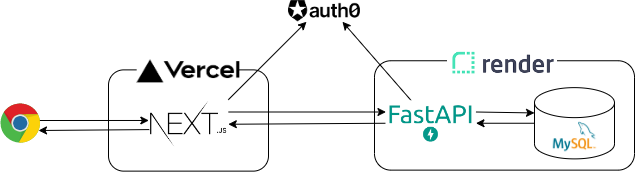

## はじめに

アーキテクチャ構成の検証結果についてまとめた資料。

## 検討方針

後述する判断基準に従って、[ぼくのかんがえたさいきょうの個人開発あーきてくちゃ](https://zenn.dev/eringiv3/articles/c44d5400e5603e)を参考に検討すすめた。

- 無料であること
- AWS、GCP、Azure意外のサービスを使うこと
- フロントエンドはReact、バックはFastAPIであること
- RDSを搭載可能なこと
- GitHubと連携可能なこと

## アーキテクチャ構成

## 参考サイト

- ChatGPTとのやり取りの履歴：https://chat.openai.com/c/a78eef8a-2d05-4105-bfe7-a17abf8195c3
- [実質無料で使える Hosting Service の比較や使い分けの紹介 2021](https://blog.ojisan.io/hosting-battle-2021/)

- [Render公式ドキュメント](https://render.com/)
- [認証基盤サービス「Auth0」を使ってみる | DevelopersIO](https://dev.classmethod.jp/articles/auth0-overview/)
- [SaaS系スタートアップのためのスケールする認証基盤構築 | TC3株式会社｜GIG INNOVATED.](https://www.tc3.co.jp/login_for_saas_startup/)
- [Heroku の無料枠が廃止されるので、代替案をもう少しまとめてみた](https://zenn.dev/chizu_puzzle/articles/c017e772c6faaa)
- [Render.comが素敵過ぎるのでもっと知られて欲しい](https://zenn.dev/mitsuruokura/articles/12b17d406902ab)
- [手軽に高速にWebサイトを公開！ Webホスティングサービス「Vercel」の概要と使い方 (1/4)|CodeZine（コードジン）](https://codezine.jp/article/detail/15780)
- [個人開発のコストはDB次第 - laiso](https://laiso.hatenablog.com/entry/nope-sql)
- [HerokuでPythonアプリのデプロイ｜KIYO｜note](https://note.com/kiyo_ai_note/n/n92996e959c3d#d36a0041-552c-4769-a8bc-9f0c89d0b3ec)
- [認証基盤サービス「Auth0」を使ってみる | DevelopersIO](https://dev.classmethod.jp/articles/auth0-overview/)
- [SaaS系スタートアップのためのスケールする認証基盤構築 | TC3株式会社｜GIG INNOVATED.](https://www.tc3.co.jp/login_for_saas_startup/)

---

**[TODO]**移行で実際に手を動かした結果について適時整理していく。

